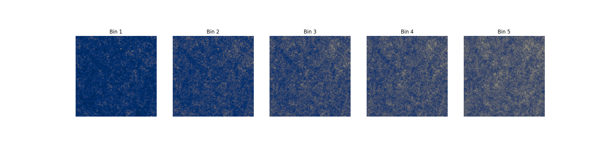

<h1 align='center'>sbi_lens</h1>
<h2 align='center'>JAX-based log-normal lensing simulation package.</h2>

**sbi_lens** provides a diferentiable log-normal mass map simulator with 5 tomographic redshift bins and 6 cosmological parameters to infer ($\Omega_c, \Omega_b, \sigma_8, n_s, w_0, h_0$). The shift parameter is computed with [CosMomentum](https://github.com/OliverFHD/CosMomentum) and depends on $\Omega_c, \sigma_8, w_0$.


Note: only LSST year 10 implemented for the moment. 

# Installation

```sh
pip install git+https://github.com/DifferentiableUniverseInitiative/sbi_lens.git
```

# Quick example


``` python

# load lsst year 10 settings 
from sbi_lens.config import config_lsst_y_10

N                = config_lsst_y_10.N
map_size         = config_lsst_y_10.map_size
sigma_e          = config_lsst_y_10.sigma_e
gals_per_arcmin2 = config_lsst_y_10.gals_per_arcmin2
nbins            = config_lsst_y_10.nbins
a                = config_lsst_y_10.a
b                = config_lsst_y_10.b
z0               = config_lsst_y_10.z0


# define lsst year 10 log normal model 
from sbi_lens.simulator.LogNormal_field import lensingLogNormal

model = partial(
    lensingLogNormal, 
    N=N,
    map_size=map_size,
    gal_per_arcmin2=gals_per_arcmin2,
    sigma_e=sigma_e,
    nbins=nbins,
    a=a,
    b=b,
    z0=z0,
    model_type='lognormal',
    lognormal_shifts='LSSTY10',
    with_noise=False,
)

# simulate one mass map 
from sbi_lens.simulator.utils import get_samples_and_scores

(log_prob, samples), gradients = get_samples_and_scores(
  model,
  PRNGKey(0),
  batch_size=1,
  with_noise=False
)
map_example = samples['y']
```

``` python 
%pylab inline
figure(figsize=(20,5))

for i in range(5):

  subplot(1,5, i+1)
  imshow(map_example[0][...,i], cmap='cividis')
  title('Bin %d'%(i+1))
  axis('off')
```
<p align=center>
    
</p>

Check out a full example here: [](https://colab.research.google.com/drive/1pSjhrOJbVi80RQlsVz2oXhVAtxwBhSbn?usp=sharing)


# Contributors

# Licence

MIT
