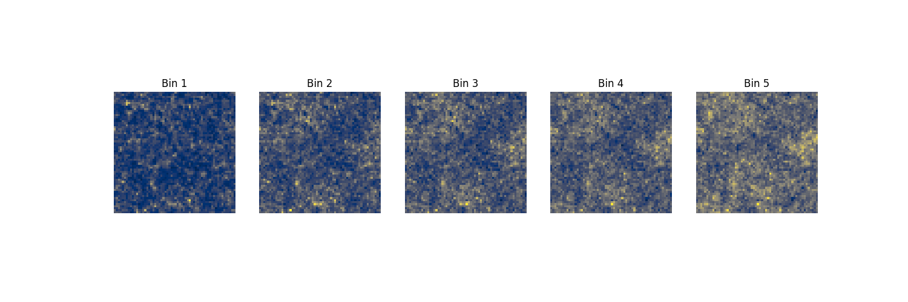
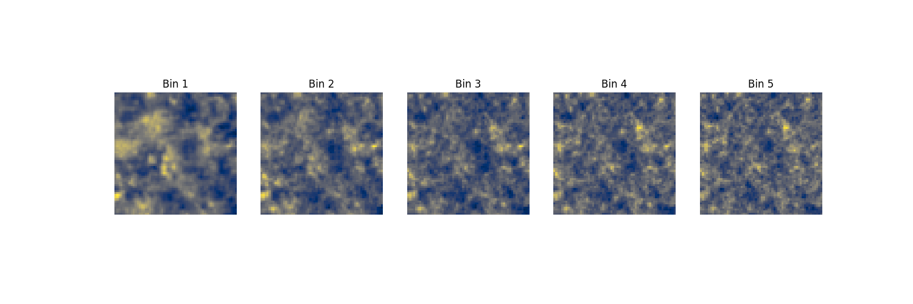

<div align='center'>
  <ul>
    <summary><h1>sbi_lens</h1></summary>
  </ul>
</div>

<div align="center">

[]() [](https://github.com/psf/black) [](https://github.com/DifferentiableUniverseInitiative/sbi_lens/blob/main/LICENSE) [](https://github.com/DifferentiableUniverseInitiative/sbi_lens/graphs/contributors)

</div>

<hr><hr>

<div align='center'>
  <ul>
    <summary><h2>JAX-based lensing simulation package.</h2></summary>
  </ul>
</div>

`sbi_lens` provides a range of lensing forward models, including Gaussian model, log-normal model and LPT model. Powered by JAX, our codebase is fast and fully differentiable.
It is specifically designed to match  LSST Y10 survey setting, but it can be easily adapted.

<hr><hr>

# Installation

```sh
pip install git+https://github.com/DifferentiableUniverseInitiative/sbi_lens.git
```
# Quick example

```python
# load lsst year 10 settings
from sbi_lens.config import config_lsst_y_10

sigma_e          = config_lsst_y_10.sigma_e
gals_per_arcmin2 = config_lsst_y_10.gals_per_arcmin2
nbins            = config_lsst_y_10.nbins
a                = config_lsst_y_10.a
b                = config_lsst_y_10.b
z0               = config_lsst_y_10.z0
```

**Log-Normal Simulation**
``` python
# define lsst year 10 log normal model
from sbi_lens.simulator.LogNormal_field import lensingLogNormal

model_log_normal = partial(
    lensingLogNormal,
    N=60,
    map_size=5,
    gal_per_arcmin2=gals_per_arcmin2,
    sigma_e=sigma_e,
    nbins=nbins,
    a=a,
    b=b,
    z0=z0,
    model_type='lognormal',
    lognormal_shifts='LSSTY10',
    with_noise=False,
)

# simulate one mass map
from sbi_lens.simulator.utils import get_samples_and_scores

(log_prob, samples), gradients = get_samples_and_scores(
  model_log_normal,
  PRNGKey(0),
  batch_size=1,
  with_noise=False
)
map_example_log_normal = samples['y']
```

``` python
for i in range(5):
  subplot(1,5, i+1)
  imshow(map_example_log_normal[0][...,i], cmap='cividis')
  title('Bin %d'%(i+1))
  axis('off')
```
<p align=center>
    
</p>


**LPT Simulation**
``` python
# define lsst year 10 lpt model
from sbi_lens.simulator.Lpt_field import lensingLpt
model_lpt = partial(
    lensingLpt,
    N=60,
    map_size=5,
    box_size=[400.0, 400.0, 4000.0],
    box_shape=[300, 300, 128],
    gal_per_arcmin2=gals_per_arcmin2,
    sigma_e=sigma_e,
    nbins=nbins,
    a=a,
    b=b,
    z0=z0,
    with_noise=False,
)

# simulate one mass map
from sbi_lens.simulator.utils import get_samples_and_scores

(log_prob, samples), gradients = get_samples_and_scores(
  model_lpt,
  PRNGKey(0),
  batch_size=1,
  with_noise=False
)
map_example_lpt = samples['y']
```

``` python
for i in range(5):
  subplot(1,5, i+1)
  imshow(map_example_lpt[0][...,i], cmap='cividis')
  title('Bin %d'%(i+1))
  axis('off')
```
<p align=center>
    
</p>

Check out a full example here: [](https://colab.research.google.com/drive/1pSjhrOJbVi80RQlsVz2oXhVAtxwBhSbn?usp=sharing)

# Contributors

Thanks goes to these wonderful people ([emoji key](https://allcontributors.org/docs/en/emoji-key)):

<table>
  <tr>
    <td align="center"><a href="https://aboucaud.github.io"><br /><sub><b>Alexandre Boucaud</b></sub></a><br /><a href="https://github.com/DifferentiableUniverseInitiative/sbi_lens/commits?author=aboucaud" title="Code">💻</a></td>
    <td align="center"><a href="http://flanusse.net"><br /><sub><b>Francois Lanusse</b></sub></a><br /><a href="https://github.com/DifferentiableUniverseInitiative/sbi_lens/commits?author=EiffL" title="Code">💻</a></td>
    <td align="center"><a href="https://www.cosmostat.org/people/denise-lanzieri"><br /><sub><b>Denise Lanzieri</b></sub></a><br /><a href="https://github.com/DifferentiableUniverseInitiative/sbi_lens/commits?author=dlanzieri" title="Code">💻</a></td>
    <td align="center"><a href="https://github.com/Justinezgh"><br /><sub><b>Justine Zeghal</b></sub></a><br /><a href="https://github.com/DifferentiableUniverseInitiative/sbi_lens/commits?author=Justinezgh" title="Code">💻</a></td>
  </tr>
</table>
